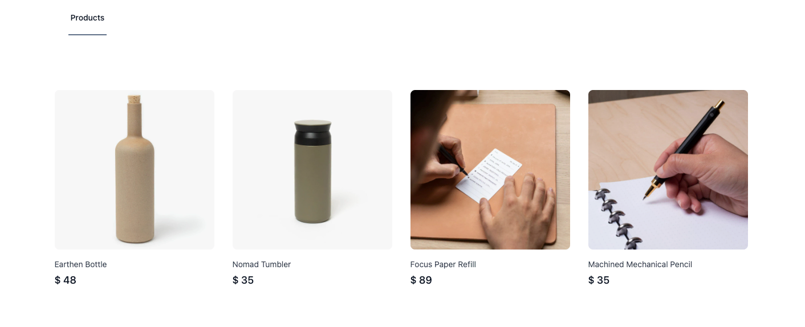
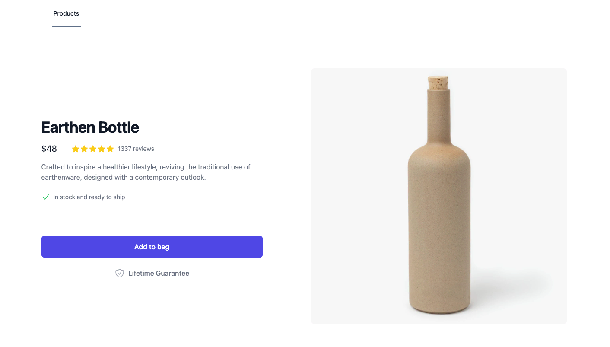
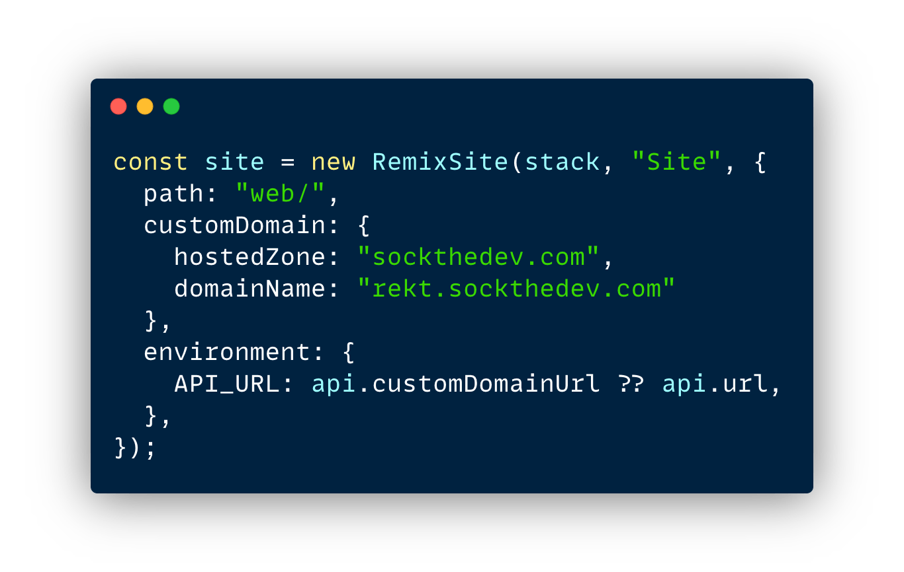

_Work in Progress_

# ReKt Stack

An end-to-end TypeScript, DB to UI, Remix based stack.

- [Tech Stack](#tech-stack)
  - [Remix](#remix)
  - [tRPC](#trpc)
  - [Kysely](#kysely)
  - [Planetscale](#planetscale)
  - [SST](#sst)

&nbsp;

<h1 align="center">💅</h1>

  

  

&nbsp;

<h1 align="center">🔥</h1>

  

&nbsp;

<h1 align="center">🎬</h1>

  <em>Coming soon</em>

&nbsp;

## Tech Stack

### Remix

A React based SSR framework that has a much simpler API surface area than Next.js, and leans into web standards.

### tRPC

A mechanism of defining and consuming APIs utilising TypeScript _without_ the need of any intermediary CLI to generate types.

### Kysely

A SQL query builder that was built from the ground up to be used via TypeScript.

**Why not Prisma!?!? 🤔**

Prisma is great ya'll, but the Prisma package is not optimised to run within a lambda. It has a significant impact on your cold starts. Kysely provides a similar DX, without the cost of performance.

We utilise Kysely Codegen to generate the types representing our Database.

### Planetscale

Planetscale provides an amazing DX and is a truly serverless MySQL database.

### SST

An AWS CDK based framework.

You define your application infrastructure using TypeScript.

  

Those 10 lines of TypeScript give you a Remix application which runs as a serverless application fronted by CloudFront (CDN), with the capability to cache the Remix SSR responses in CloudFront.

Impressive? Add 1 more line of TypeScript to that configuration and it will server render on the Edge.

🤯

> "AWS is too complicated"

_There is no need to get AWS certification or spend a lifetime to unravel the crazy amount of services AWS offers._

SST gives you _easy_ access to all the AWS services you'll almost ever likely need.

- Compute (Lambda)
- Storage (S3)
- CDN (CloudFront)
- Push Notifications (Websocket API)
- Events/Queues/Cron jobs

> "AWS is too expensive"

SST stays away from all the expensive services. It exposes the serverless friendly services where cost scales down to $0.

Running your application (or multiple versions of it) will cost you nothing when it is not in use, and it can handle crazy scale when the time comes at _low_ cost.

> "Deploying to AWS is hard"

Is typing a 1 line command into a terminal really that difficult?

In fact, I'll one up you and let you know that you can add 1 additional parameter to that command in order to achieve an _exact_ replica of your app. Great for sharing a running preview of the new feature you are developing.

> "But lambda is slow"

We achieved perfect Lighthouse scores for an SSR Remix application which calls into an API, with the API making a call to a DB. We think you'll be fine.

> "Developing Lambda locally sucks"

SST comes with a world class DX. It doesn't try to clone AWS features. Instead it runs your application through AWS and proxies requests into your machine. This is all automated, and costs you nothing.

Make an updates to your API code whilst in development and it will insta-work. You can even attach a debugger to your Lambda and inspect the incoming request event.

SST comes with a browser based development tool, which allows you to see all the executions against your Lambdas, along with their logs etc.

> "Service X is so cool though"

Yeah they may be cool, but it's really great when you don't have to cobble together multiple service providers together to compose your application.

AWS's pricing model tends to blow the cool SaaS product alternatives out of the water;

- Send/receive **1 million** websocket events for _free_ for the first 12 months, thereafter $1.00 per million. So long Pusher.
- Send **62 thousand** every month for _free_. Adios SendGrid.

Plus, when you go all in on AWS it makes it super easy for you to create fully featured clones of your application without worrying about affecting the "production" data/configuration for any of your underlying services.

--

AWS is not complicated anymore. And we will provide some tutorials to show you just how accessible it is now. A tiny bit of learning investment could save you a ton of cash, especially as your application scales.
